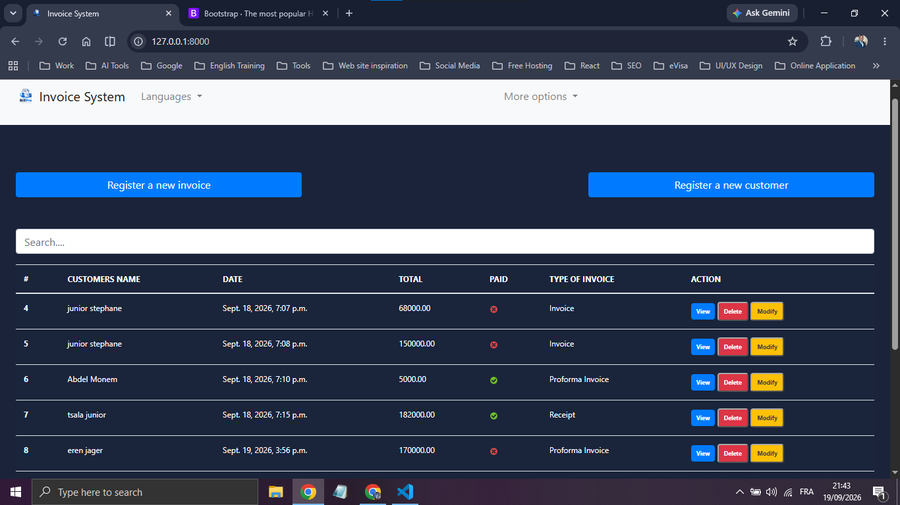
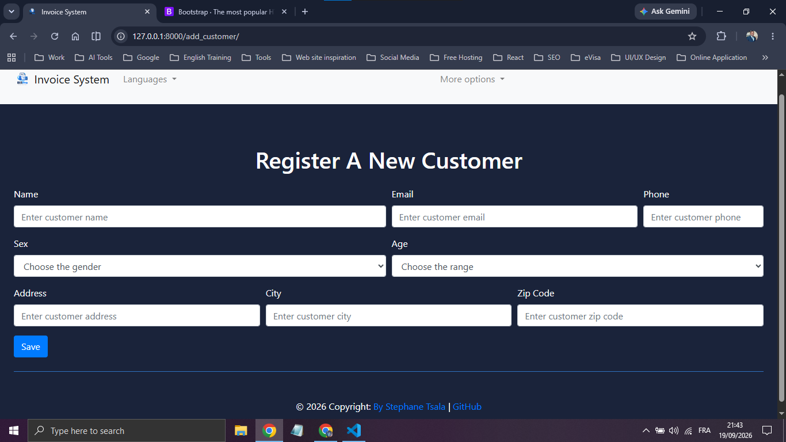
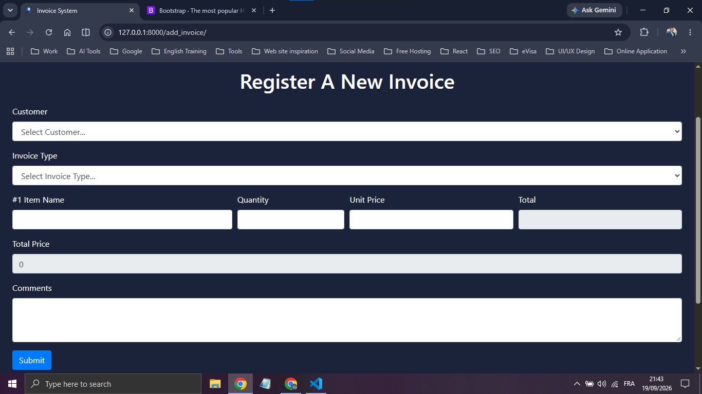
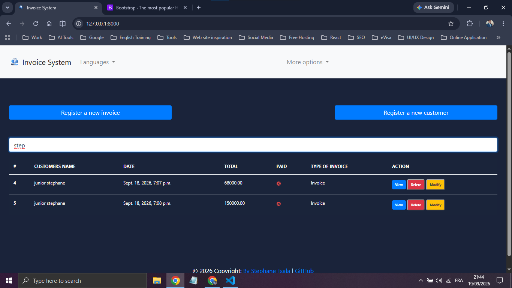
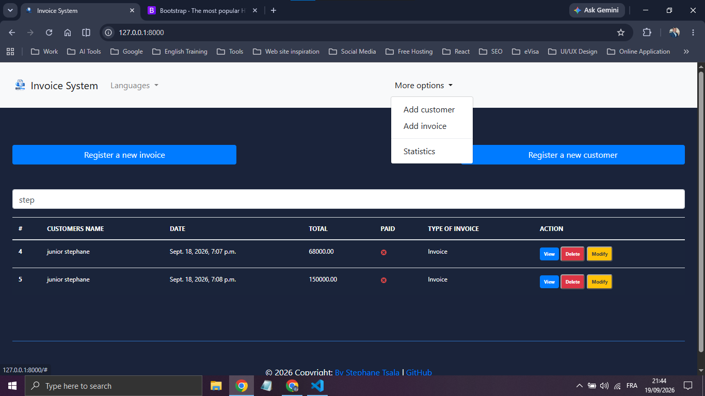
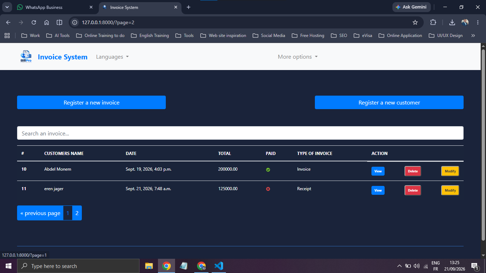
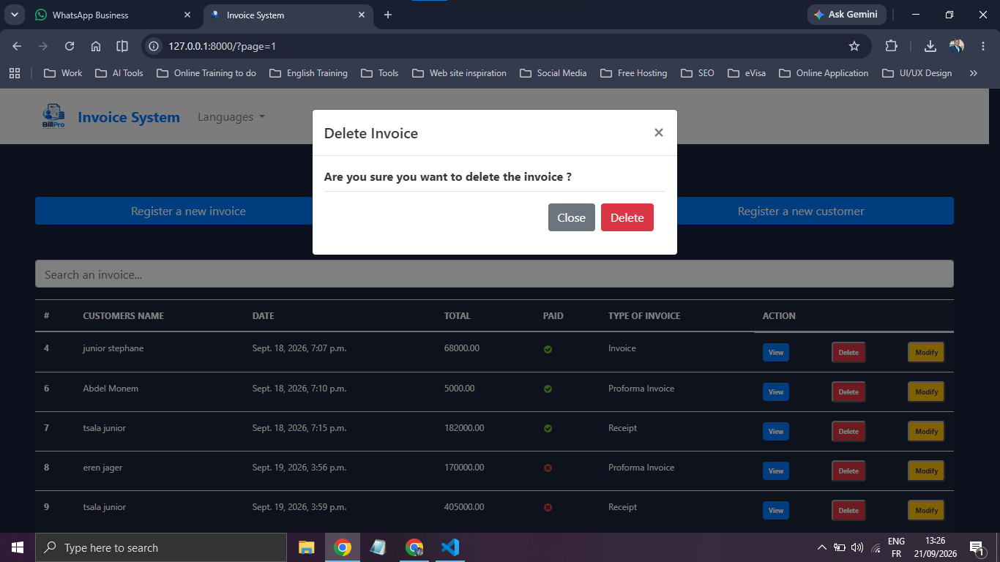
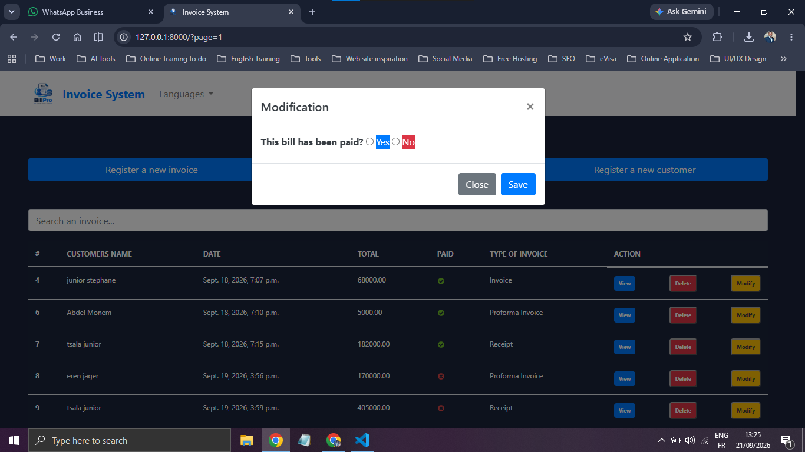

# Django Billing Application

A simple **Django-based billing management application** that allows users to authenticate, manage customers and their bills, generate PDF invoices, and print bills directly from the application.

## 🚀 Features

* 🔐 **User Authentication**

  * Connect to the application using user credentials.
  * User login and session management.
* 👤 **Customer Management**

  * Create a customer.
  * Store customer information for billing purposes.
* 🧾 **Bill Management**

  * Create a bill associated with a customer.
  * View bill details.
  * Update an existing bill.
  * Delete a bill.
  * Associate each bill with a specific customer.
* 🌍 **Multilingual Support**

  * Change the application language.
  * Interface available in multiple languages.
* 📄 **PDF Generation**

  * Generate a PDF version of a bill.
  * Download or save the generated bill as a PDF file.
* 🖨️ **Bill Printing**

  * Print bills directly from the application.
  * Printer-friendly bill format.

## 🛠️ Technologies Used

### Backend

* **Python**
* **Django**

### Frontend

* **HTML5**
* **CSS3**
* **JavaScript**
* **Bootstrap**

### Database

* **SQLite**

## 📁 Project Structure

```text
project/
│
├── manage.py
├── requirements.txt
│
├── project/
│   ├── settings.py
│   ├── urls.py
│   ├── wsgi.py
│   └── asgi.py
│
├── app/
│   ├── migrations/
│   ├── templates/
│   ├── static/
│   │   ├── css/
│   │   └── js/
│   ├── models.py
│   ├── views.py
│   ├── urls.py
│   └── forms.py
│
└── README.md
```

> The exact structure may vary depending on the organization of the Django project.

## ⚙️ Installation

### 1. Clone the repository

```bash
git clone <repository-url>
cd <project-folder>
```

### 2. Create a virtual environment

```bash
python -m venv venv
```

Activate it on Windows:

```bash
venv\Scripts\activate
```

On Linux/macOS:

```bash
source venv/bin/activate
```

### 3. Install dependencies

```bash
pip install -r requirements.txt
```

If a `requirements.txt` file is not available:

```bash
pip install django mysqlclient
```

## 🗄️ Database Configuration

This application uses **SQLite** as its database management system.

Configure the database connection in:

```text
project/settings.py
```

Example:

```python
DATABASES = {
    "default": {
        "ENGINE": "django.db.backends.sqlite3",
        "NAME": BASE_DIR/ "sqlite3"
    }
}
```

Create the database in MySQL before running the migrations.

### Apply migrations

```bash
python manage.py makemigrations
python manage.py migrate
```

## 👤 Create an Administrator

Create a Django superuser to access the application:

```bash
python manage.py createsuperuser
```

Follow the instructions displayed in the terminal.

## ▶️ Run the Application

Start the Django development server:

```bash
python manage.py runserver
```

The application will normally be available at:

```text
http://127.0.0.1:8000/
```

## 🔄 Main Workflow

The typical application workflow is:

```text
Login
  │
  ▼
Dashboard
  │
  ├── Create Customer
  │       │
  │       ▼
  │   Customer
  │       │
  │       ▼
  └── Create Bill
          │
          ├── View Bill
          ├── Update Bill
          ├── Delete Bill
          ├── Generate PDF
          └── Print Bill
```

## 🧾 Bill Management

Each bill is associated with a customer.

The application allows users to perform the main **CRUD operations**:

| Operation        | Description                      |
| ---------------- | -------------------------------- |
| **Create** | Create a new bill for a customer |
| **Read**   | View bill information            |
| **Update** | Modify an existing bill          |
| **Delete** | Remove a bill                    |

Bills can subsequently be converted into a **PDF document** or printed.

## 🌍 Language Support

The application provides a language-switching feature allowing users to change the language of the interface.

The implementation uses Django's internationalization capabilities.

## 📄 PDF & Printing

Users can:

* Generate a PDF representation of a bill.
* Save/use the generated PDF.
* Print a bill directly from the application.

The printing functionality is designed to provide a clean, printer-friendly version of the bill.

## 🔒 Security

The application uses Django's built-in authentication and security mechanisms, including:

* User authentication
* Session management
* CSRF protection
* Django ORM for database interactions

For production deployment, sensitive configuration values such as database passwords and secret keys should be stored securely rather than directly in the source code.

## 🧪 Development

During development, useful Django commands include:

```bash
# Run the server
python manage.py runserver

# Create migrations
python manage.py makemigrations

# Apply migrations
python manage.py migrate

# Create an administrator
python manage.py createsuperuser

# Open Django shell
python manage.py shell
```

## 📌 Future Improvements

Possible future improvements include:

* Customer update and delete functionality.
* Customer search and filtering.
* Bill search and filtering.
* Automatic invoice numbering.
* Bill totals and tax calculation.
* Product/service management.
* Emailing invoices to customers.
* Dashboard with billing statistics.
* User roles and permissions.
* Responsive/mobile improvements.
* Deployment to a production server.

## 👨‍💻 Author

* **LinkedIn**: [www.linkedin.com/in/stephane-tsala](https://www.linkedin.com/in/stephane-tsala/)
* **Gmail**: [stephaneboska@gmail.com](mailto:stephaneboska@gmail.com)

Django web application developed as a learning/project application demonstrating backend development with Django, MySQL database integration, frontend development, authentication, CRUD operations, PDF generation, and internationalization.

## 📄 License

This project is intended for educational and/or personal use.

## 📸 Screenshots
















